# review-watch

A skill that has a coding agent watch a worktree while a
person reviews it, and hand the agent-directed review
markers the reviewer writes, such as `// AGENT: rename this`
or `TODO(agent)`, to the address-comments skill when a scan
finds them.
It ships one program, `watch.sh`, a poller that detects
markers and does not edit.

watch.sh reports a marker written while it watches.

<picture>
  <source
    media="(prefers-reduced-motion: reduce)"
    srcset="assets/poster.svg"
  />
  
</picture>

The demo is reconstructed from
[`evidence/transcripts/watch-session.txt`](evidence/transcripts/watch-session.txt),
a captured run of `watch.sh` on a synthetic worktree. The
image leaves out blank lines.

**Not measured, stated up front.**

- No agent invoked the skill to produce the evidence here,
  and address-comments did not run. The transcript shows only
  `watch.sh`.
- Whether an agent that follows `SKILL.md` addresses each
  marker through address-comments, or stops when
  address-comments is missing, has not been measured.
- How often the marker grammar matches a comment that was
  not meant for an agent, or misses one that was, has not
  been measured. A comment such as `# Agents: list of
  workers` matches, and so does a Markdown bullet such as
  `* Agent: rename`, through the `*` leader. A marker after
  a leader the grammar
  does not list is missed: `/// agent:`, `//! agent:`,
  `/** agent:`, `## agent:` and `; agent:` are not reported
  by either backend in the tests.
- The grep fallback was tested with the BSD grep that ships
  with macOS. It had not been run with GNU grep when this
  release was cut; the CI workflow runs the suite on Ubuntu.
- Neither Claude Code nor Codex was started to confirm that
  the invocation names below resolve.

## What is in it

- [`skills/review-watch/SKILL.md`](skills/review-watch/SKILL.md)
  is the spec: when to watch, the inputs, which an optional
  per-repository wrapper can bind, the
  baseline-poll-delegate-summarize workflow, detection, and
  concurrency and safety rules.
- [`skills/review-watch/scripts/watch.sh`](skills/review-watch/scripts/watch.sh)
  scans a path with the marker grammar, sleeping
  `poll_seconds` between scans, and exits at the first scan
  that finds a marker, printing `REVIEW_WATCH_MARKERS` and
  the matching lines, or prints `REVIEW_WATCH_WINDOW_ENDED`
  when the window passes with none. It reads files and
  writes nothing.

A window above 0 that ends with `REVIEW_WATCH_WINDOW_ENDED`
lasts at least `window_seconds` and can run up to one second
longer, because the deadline is counted in whole seconds,
plus the poll interval and the scan in progress when the
deadline passes. A marker already present ends the watch at
the first scan.

`watch.sh` reports the markers present at a scan in the
files it searches, not only new ones. The skill relies on address-comments
removing each marker it addresses, so a marker that stays in
the tree is reported again at the next start.

### Exit statuses

| Status | When                                                                                               |
| ------ | -------------------------------------------------------------------------------------------------- |
| 0      | It printed `REVIEW_WATCH_MARKERS` and the matches, or `REVIEW_WATCH_WINDOW_ENDED`.                  |
| 1      | No `watch_path` argument was given, or it was empty.                                               |
| 2      | `window_seconds` is empty or not a whole number of seconds from 0 to 999999999 without leading zeros, for example `10m` or `08`; or the watch path is, or is inside, an excluded directory; or it is a symlink that does not point to a directory; or it, or its parent directory, cannot be entered to check where it is. |
| 3      | Neither `rg` nor `grep` is on `PATH`, `date` or `sleep` is not on `PATH`, or the search exited with status 2 or more. |

Statuses 1, 2 and 3 print a message to standard error and
nothing to standard output. Status 3 also covers a scan in
which the tool found markers but also hit an error, for
example a file that could not be read; those markers are not
printed.
A window of `0` ends with `REVIEW_WATCH_WINDOW_ENDED`
without scanning at all. A watch path that starts with `-`,
including `-` itself, is searched as `./<path>`, so neither
tool reads it as an option or as standard input.

### Excluded directories

Excluded directories, any directory named `node_modules`,
`.next` or `.git`, are never searched, even when named as
the watch path: `watch.sh` refuses a watch path that is one
of them or is inside one, printing a message and exiting 2.
The watch path is checked in two forms, and refused if
either has an excluded component: as written, with `.` and
`..` components folded away, and where it physically is,
which is a directory's physical absolute path, or for
anything else its parent directory's physical absolute path
and its own name. So `node_modules/../src` is searched; `.`
inside `node_modules`, a symlink into one, and a path
through a symlink named `node_modules` are refused. A
symlink that does not point to a directory is refused with
exit 2, with or without a trailing slash, because where it
leads is not checked. When a symlink makes the physical path
differ from the folded one, the physical path is searched
and its matches print that path. A path whose parent does
not exist is checked as written. The names are compared
case-sensitively; case-insensitive file systems were not
tested. A name that only contains one of the three, such as
`node_modules.bak`, is searched.

### Search backends

`watch.sh` uses ripgrep when `rg` is on `PATH`, and
`grep -rEn -i -I` when it is not. Both are given the same
marker grammar; the grep form spells it in POSIX ERE.
`tests/test_watch.py` runs the shared cases, which are ASCII
text, on both. The differences known when this release was
cut:

- ripgrep skips hidden files and directories, files that a
  `.gitignore` excludes inside a git repository, and files
  that a `.ignore` or `.rgignore` file excludes. grep searches
  all of them.
- Not a difference: both skip directories named
  `node_modules`, `.next` and `.git` at any depth, wherever
  `watch.sh` runs from and however the watch path is
  written. The excluded-directory rule is under "Excluded
  directories" above.
- ripgrep runs with `--no-config`, so a
  `RIPGREP_CONFIG_PATH` in the environment is not read.
- ripgrep's hidden-file and ignore rules apply to what it
  finds while it descends, not to the watch path itself:
  given `.github` as the watch path, it searches it.
- `REVIEW_WATCH_LABELS` is passed to whichever tool runs,
  so write it in syntax both accept, such as
  `reviewer[[:space:]]+says:`.
- With more than one matching file, the order of the lines
  is not fixed.
- Binary files: both skipped the small binary files in the
  tests when found inside a directory. Large files, where
  the first NUL byte comes late, were not tested. Given a
  single binary file as the watch path, ripgrep prints a
  `binary file matches` notice, which `watch.sh` reports as
  a marker; grep skips it.
- Not a difference: a watch path that is itself a symlink
  to a directory is searched by both, because `watch.sh`
  passes its physical path to the tool.
- Given a single file as the watch path, ripgrep prints
  `line:text` without the file name; the BSD grep that
  ships with macOS prints the file name.
- Matching of non-ASCII text, such as a non-ASCII letter
  after `to agent` or a non-ASCII space after a comment
  leader, depends on the tool and, for grep, on the locale.
  It was not tested.
- ripgrep's documentation lists further ignore sources, such
  as a global git ignore file and `.git/info/exclude`. They
  were not tested here.
- GNU grep was not run for this release. The bullets above
  that name BSD grep describe what it did; GNU grep may
  differ on the file-name point.

## Not included

- `address-comments` is required and is not shipped here.
  It is a separate skill, published as
  `trycopilotai/address-comments`, that owns the marker
  grammar, the change, the marker's removal and the review
  log entry. review-watch only detects markers and delegates
  each one to it. When address-comments is not installed,
  `watch.sh` still detects and prints markers, and
  `SKILL.md` tells the agent to report the markers it found,
  say that address-comments is missing, and stop without
  editing.
- A per-repository wrapper is not shipped either.
  `SKILL.md` lets one bind which address-comments to call, the watched path, the excludes and the window, and to
  name any extra operator labels for `REVIEW_WATCH_LABELS`.
  It is optional. Without one, `SKILL.md` tells the agent to
  take the watched path from the request, use the skill named
  `address-comments`, and use `watch.sh`'s defaults: a
  600-second window, a 12-second poll, and its fixed
  excludes.

`trycopilotai/swe-day` calls review-watch at its step 12,
while a person reviews the worktree. review-watch does not
need swe-day.

## Use it

Read [`skills/review-watch/SKILL.md`](skills/review-watch/SKILL.md)
before you install it. The file is an instruction set that
steers an agent, so both installs below are pinned to a tag
rather than to `main`.

### Claude Code

Save this as `install.sh` and run it with `sh install.sh`.
It sets `set -eu` and an `EXIT` trap, so pasting it straight
into an interactive shell will end that shell if the clone
fails.

```sh
set -eu
release=v0.1.0
install_target="$HOME/.claude/skills/review-watch"
install_parent="$(dirname "$install_target")"
mkdir -p "$install_parent"
install_tmp="$(mktemp -d "$install_parent/.review-watch.XXXXXX")"
install_stage="$install_tmp/package"
rollback_install() {
  if [ ! -e "$install_target" ]; then
    if [ -e "$install_tmp/previous" ]; then
      mv "$install_tmp/previous" "$install_target"
    fi
  fi
  rm -rf "$install_tmp"
}
trap rollback_install EXIT
git clone --quiet --depth 1 --branch "$release" \
  https://github.com/trycopilotai/review-watch \
  "$install_tmp/clone"
mkdir -p "$install_stage"
cp -R "$install_tmp/clone/skill/." "$install_stage/"
if [ -e "$install_target" ]; then
  mv "$install_target" "$install_tmp/previous"
fi
mv "$install_stage" "$install_target"
trap - EXIT
rm -rf "$install_tmp"
```

Invoke it as `/review-watch`.

### Codex

Save this one the same way. The only line that differs from
the block above is `install_target`.

```sh
set -eu
release=v0.1.0
install_target="$HOME/.agents/skills/review-watch"
install_parent="$(dirname "$install_target")"
mkdir -p "$install_parent"
install_tmp="$(mktemp -d "$install_parent/.review-watch.XXXXXX")"
install_stage="$install_tmp/package"
rollback_install() {
  if [ ! -e "$install_target" ]; then
    if [ -e "$install_tmp/previous" ]; then
      mv "$install_tmp/previous" "$install_target"
    fi
  fi
  rm -rf "$install_tmp"
}
trap rollback_install EXIT
git clone --quiet --depth 1 --branch "$release" \
  https://github.com/trycopilotai/review-watch \
  "$install_tmp/clone"
mkdir -p "$install_stage"
cp -R "$install_tmp/clone/skill/." "$install_stage/"
if [ -e "$install_target" ]; then
  mv "$install_target" "$install_tmp/previous"
fi
mv "$install_stage" "$install_target"
trap - EXIT
rm -rf "$install_tmp"
```

Invoke it as `$review-watch`.

Each block works in a temporary `.review-watch.*` directory
beside the target and removes it on exit. An existing install
at the target is replaced. A dangling symlink at the target
is not: `mv` fails with "Not a directory", the block exits
non-zero, and the link is left in place.

While it clones, `git` warns that the tag "is not a commit"
and notes a detached `HEAD`. Both are expected for a clone
pinned to an annotated tag.

Both blocks copy through `skill/`, a symlink to
`skills/review-watch/`, so the installed directory holds
`SKILL.md`, `agents/` and `scripts/` as real files. The
repository also carries `.claude-plugin/plugin.json` and
`.codex-plugin/plugin.json` for a marketplace. No
marketplace lists this skill, so no marketplace install is
described here. The manifests have not been checked against
any marketplace's submission rules; the Codex one names no
logo or composer icon.

## Evidence

`evidence/transcripts/watch-session.txt` is the captured
run behind the claim at the top of this file.
`scripts/record_session.py` wrote each `$` line and each
exit status; the rest is the commands' output, standard
output and standard error together, unedited. Every path the
commands print is relative to the throwaway directory, so no
path had to be replaced. The session ran with ripgrep on
`PATH`, so it shows the ripgrep backend only.

In the command that starts with `(sleep 2;`, a background
subshell appends a marker two seconds after `watch.sh`
starts, and `watch.sh` reports it at a later one-second
poll, well inside its 30-second window. The last two
commands show the usage error for a window written as `10m`
and the status-3 exit for a directory that does not exist.

`evidence/demo-manifest.json` records the commands, the
ripgrep and bash versions, the date, and the SHA-256 of
`watch.sh`, `SKILL.md` and the transcript, and declares
that no agent invoked the skill.

`make check` runs the watcher's tests on both backends and
a packaging contract that ties this file, both plugin
manifests, the transcript and the demo images to each other.

## Contributing

See [`CONTRIBUTING.md`](CONTRIBUTING.md).

## Security

See [`SECURITY.md`](SECURITY.md).

## License

MIT. See [`LICENSE`](LICENSE).

## Not affiliated with GitHub or GitHub Copilot

The `trycopilotai` organisation name is not a claim of any
relationship with GitHub Copilot. This project is not
affiliated with, endorsed by, or sponsored by GitHub, Inc.
GitHub and GitHub Copilot are trademarks of GitHub, Inc.
